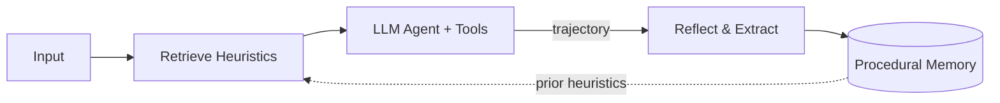

<div align="center">

# LangChain Meta-Reflect

**Self-Improving Agents with Procedural Memory**

[](LICENSE)
[](https://www.python.org/downloads/)
[](https://github.com/langchain-ai/langchain)
[](https://arxiv.org/abs/2603.19461)
[](https://arxiv.org/abs/2603.24639)
[](https://arxiv.org/abs/2601.11974)
[](https://arxiv.org/abs/2505.22954)
[](CONTRIBUTING.md)
[](.)

</div>

**Meta-Reflect** extends LangChain with agents that **learn from experience across task executions**. Instead of starting fresh each time, the agent reflects on its own execution traces, distills reusable heuristics (success patterns, failure patterns, guidelines), and retrieves them before future tasks — no manual prompt engineering required.

---

## Changes at a Glance

| What | Where | Description |
|------|-------|-------------|
| `BaseProceduralMemory` | `langchain_core.memory.procedural` | Abstract interface for heuristic storage & retrieval |
| `InMemoryProceduralMemory` | `langchain_classic.memory.procedural_memory` | LLM-powered reflection & retrieval over execution traces |
| `SelfImprovingAgentExecutor` | `langchain_classic.agents.meta_reflect` | Agent executor wrapping any tool-calling agent with pre-task heuristic injection + post-task reflection |
| `create_meta_reflect_agent()` | `langchain_classic.agents.meta_reflect` | Factory function for one-liner setup |

**Zero breaking changes.** All existing LangChain agents continue to work unmodified.

---

## Quickstart

```python
from langchain_openai import ChatOpenAI
from langchain_core.tools import tool
from langchain_classic.agents.meta_reflect import create_meta_reflect_agent
from langchain_classic.memory.procedural_memory import InMemoryProceduralMemory

@tool
def calculator(expr: str) -> str:
    """Evaluate a math expression."""
    return str(eval(expr))

llm = ChatOpenAI(model="gpt-4o")
memory = InMemoryProceduralMemory(llm=llm)
agent = create_meta_reflect_agent(llm=llm, tools=[calculator], procedural_memory=memory, verbose=True)

result = agent.invoke({"input": "Calculate 15 * 7 + 3"})
# After this, the agent has stored heuristics about using calculator
result = agent.invoke({"input": "Calculate (42 - 8) * 2"})
# Second call benefits from past experience
print(f"Heuristics learned: {len(agent.procedural_memory)}")
```

---

## How It Works



| Phase | What happens |
|-------|-------------|
| **Before task** | Relevant heuristics retrieved from procedural memory and injected into the agent's system prompt |
| **During task** | Standard tool-calling agent loop (unchanged) |
| **After task** | Meta-cognitive LLM reviews the execution trace, extracts success patterns, failure patterns, and general guidelines |
| **Across tasks** | Heuristics accumulate — the agent gets smarter with use |

---

## Comparison

| | Standard `AgentExecutor` | `SelfImprovingAgentExecutor` |
|---|---|---|
| Cross-task learning | ❌ None | ✅ Procedural memory accumulates experience |
| Mistake avoidance | ❌ Repeats errors | ✅ Failure patterns prevent recurrence |
| Strategy reuse | Manual prompt engineering | Automatic heuristic extraction |
| Improvement over time | Static | Self-improving with use |

---

## Research

Synthesizes insights from 6 recent arXiv papers on self-improving agents — see [`RESEARCH.md`](RESEARCH.md) for the full survey.

| Paper | arXiv |
|-------|-------|
| HyperAgents | [2603.19461](https://arxiv.org/abs/2603.19461) |
| Experiential Reflective Learning | [2603.24639](https://arxiv.org/abs/2603.24639) |
| MARS | [2601.11974](https://arxiv.org/abs/2601.11974) |
| Darwin Gödel Machine | [2505.22954](https://arxiv.org/abs/2505.22954) |
| Mem^p | [2508.06433](https://arxiv.org/abs/2508.06433) |
| AdMem | [2606.06787](https://arxiv.org/abs/2606.06787) |

---

## Installation

```bash
git clone https://github.com/NullLabTests/langchain-meta-reflect.git
cd langchain-meta-reflect
pip install -e libs/core -e libs/langchain
pip install langchain-openai  # or your preferred provider
```

## Tests

```bash
python -m pytest libs/langchain/tests/unit_tests/agents/test_meta_reflect_core.py -v
```

## License

MIT — this is an enhanced fork of [LangChain](https://github.com/langchain-ai/langchain) retaining its permissive license for all unmodified components.
