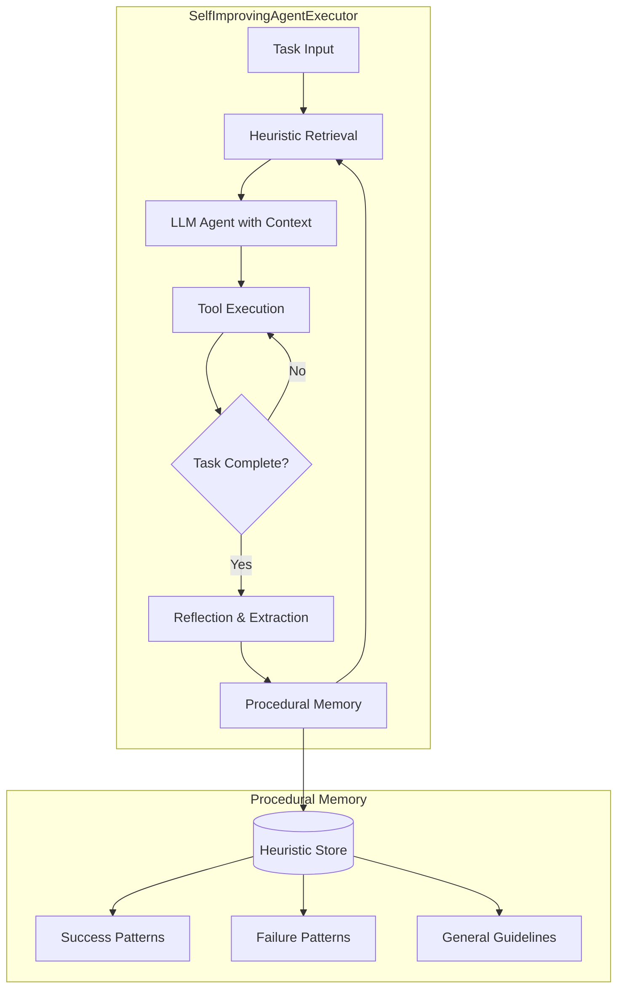
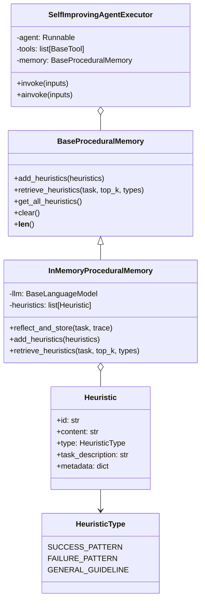

<div align="center">

# LangChain Meta-Reflect

**Self-Improving Agents with Procedural Memory**

[](LICENSE)
[](https://www.python.org/downloads/)
[](https://pypi.org/project/langchain-core/)
[](https://arxiv.org/abs/2603.19461)
[](https://arxiv.org/abs/2603.24639)
[](CONTRIBUTING.md)

</div>

---

## What's New

**Meta-Reflect** adds a **self-improving agent** to LangChain that learns across
task executions by maintaining a procedural memory of reusable heuristics.

Key innovation: Instead of starting from scratch on every task, the agent:
1. **Retrieves** relevant heuristics from past experience before each task
2. **Reflects** on its execution after each task to extract new heuristics
3. **Improves** autonomously over time without manual prompt engineering

This is not prompt engineering — it's **experience-driven self-improvement**.

---

## Research Backing

This feature synthesizes insights from recent advances in self-improving AI agents:

| Paper | arXiv | Contribution |
|-------|-------|-------------|
| **HyperAgents** | [2603.19461](https://arxiv.org/abs/2603.19461) | Self-referential agents that modify their own behavior |
| **Experiential Reflective Learning** | [2603.24639](https://arxiv.org/abs/2603.24639) | Reusable heuristics from execution trajectories |
| **MARS** | [2601.11974](https://arxiv.org/abs/2601.11974) | Efficient single-cycle metacognitive reflection |
| **Darwin Gödel Machine** | [2505.22954](https://arxiv.org/abs/2505.22954) | Open-ended self-improvement through evolution |
| **Mem^p** | [2508.06433](https://arxiv.org/abs/2508.06433) | Procedural memory as a first-class optimization object |
| **AdMem** | [2606.06787](https://arxiv.org/abs/2606.06787) | Unified semantic+episodic+procedural memory |

---

## Architecture



### Component Diagram



---

## Installation

```bash
# Clone this enhanced fork
git clone https://github.com/NullLabTests/langchain-meta-reflect.git
cd langchain-meta-reflect

# Install core dependencies
pip install -e libs/core
pip install -e libs/langchain

# Install an LLM provider (e.g., OpenAI)
pip install langchain-openai
```

---

## Quickstart

```python
from langchain_openai import ChatOpenAI
from langchain_classic.agents.meta_reflect import create_meta_reflect_agent
from langchain_classic.memory.procedural_memory import (
    InMemoryProceduralMemory,
)
from langchain_core.tools import tool

# 1. Define tools
@tool
def calculator(expression: str) -> str:
    """Evaluate a mathematical expression."""
    return str(eval(expression))

tools = [calculator]

# 2. Initialize LLM and procedural memory
llm = ChatOpenAI(model="gpt-4o")
memory = InMemoryProceduralMemory(llm=llm)

# 3. Create self-improving agent
agent = create_meta_reflect_agent(
    llm=llm,
    tools=tools,
    procedural_memory=memory,
    verbose=True,
)

# 4. First invocation — no prior experience
result = agent.invoke({"input": "Calculate 15 * 7 + 3"})
print(result["output"])  # 108

# The agent has now learned heuristics about using the calculator

# 5. Second invocation — benefits from past experience
result = agent.invoke({"input": "Calculate (42 - 8) * 2"})
print(result["output"])  # 68

# 6. Check accumulated knowledge
print(f"Heuristics learned: {len(agent.procedural_memory)}")
```

---

## How It Works

### Before Execution: Heuristic Injection

The agent retrieves relevant heuristics from procedural memory and injects them
into the system prompt as contextual guidance. These heuristics might be:

- *"Always verify intermediate results by breaking complex calculations into steps."*
- *"When using the calculator tool, pass the full expression as a single string."*
- *"Avoid chaining too many operations — verify after each step."*

### After Execution: Reflective Extraction

The agent's meta-cognitive module reviews the execution trace and extracts new
heuristics:

```
Trace: Thought: I need to multiply 15 by 7...
       Action: calculator(15 * 7)
       Observation: 105
       ...

Extracted Heuristics:
  SUCCESS_PATTERN: Break complex expressions into sub-operations for clarity.
  FAILURE_PATTERN: Avoid using commas in calculator expressions.
  GENERAL_GUIDELINE: When result seems unexpected, verify with a second approach.
```

### Over Time: Cumulative Learning

With repeated use, the procedural memory grows into a rich knowledge base of
domain-specific strategies, making the agent increasingly competent without
any manual tuning.

---

## Comparison with Standard LangChain

| Feature | Standard `AgentExecutor` | `SelfImprovingAgentExecutor` |
|---------|------------------------|------------------------------|
| Cross-task learning | None | Procedural memory accumulates experience |
| Mistake avoidance | Cannot learn | Failure patterns prevent recurrence |
| Strategy reuse | Manual prompt engineering | Automatic heuristic extraction |
| Improvement over time | Static | Self-improving with use |
| Complexity overhead | Baseline | One additional component |
| API compatibility | Yes | Wraps existing agent patterns |

---

## Core Abstractions

### `BaseProceduralMemory`
Abstract interface in `langchain_core.memory.procedural`:
- `add_heuristics()` — Store heuristics
- `retrieve_heuristics()` — Get relevant heuristics for a task
- `get_all_heuristics()` — List all stored knowledge
- `clear()` — Reset memory

### `InMemoryProceduralMemory`
Concrete implementation in `langchain_classic.memory.procedural_memory`:
- Uses an LLM for reflection and retrieval
- Organizes heuristics by type (success, failure, guideline)
- Supports filtering by heuristic type

### `SelfImprovingAgentExecutor`
Agent executor in `langchain_classic.agents.meta_reflect.base`:
- Wraps a tool-calling agent with procedural memory
- Injects heuristics before each run
- Reflects after each run
- Supports both sync (`invoke`) and async (`ainvoke`)

---

## Development

```bash
# Run core tests
python -m pytest libs/langchain/tests/unit_tests/agents/test_meta_reflect_core.py -v

# Run all tests
python -m pytest libs/langchain/tests/unit_tests/agents/ -v
```

---

## License

This project is licensed under the **MIT License** — see the [LICENSE](LICENSE) file for details.

It is an enhanced fork of [LangChain](https://github.com/langchain-ai/langchain),
retaining the original MIT license for all unmodified components. The new
research-inspired components (procedural memory, self-improving agent) follow
the same permissive licensing.

---

## Citation

If you use this work in research, please cite the underlying papers:

```bibtex
@misc{zhang2026hyperagents,
    title={HyperAgents: Self-Referential Agents that Modify Themselves},
    author={Zhang et al.},
    year={2026},
    eprint={2603.19461},
    archivePrefix={arXiv},
}

@misc{erl2026,
    title={Experiential Reflective Learning for Self-Improving LLM Agents},
    author={Multiple Authors},
    year={2026},
    eprint={2603.24639},
    archivePrefix={arXiv},
}
```
